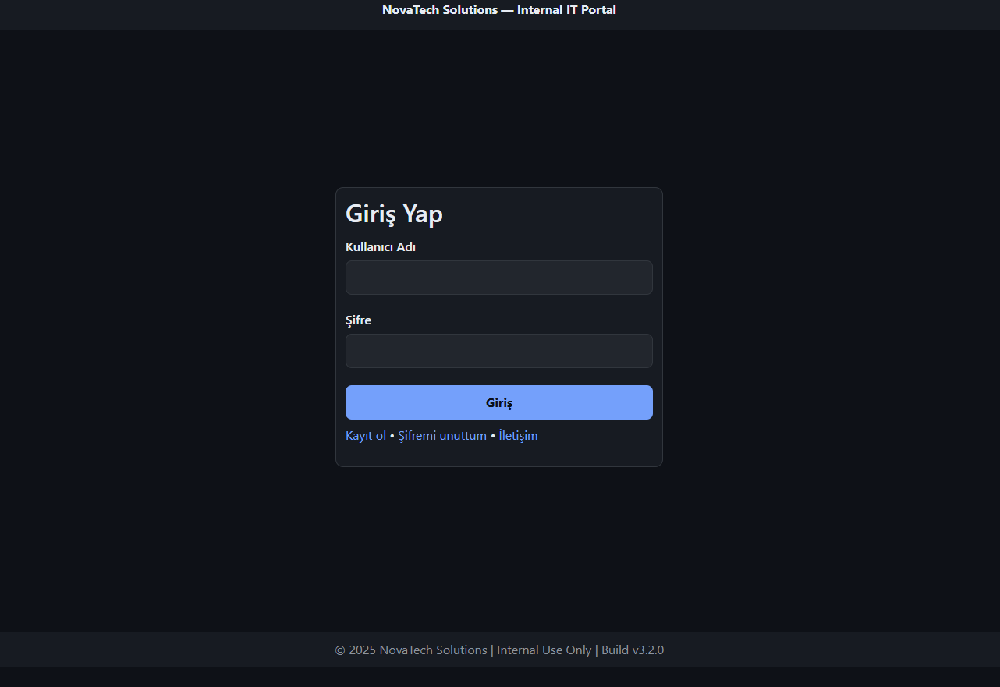
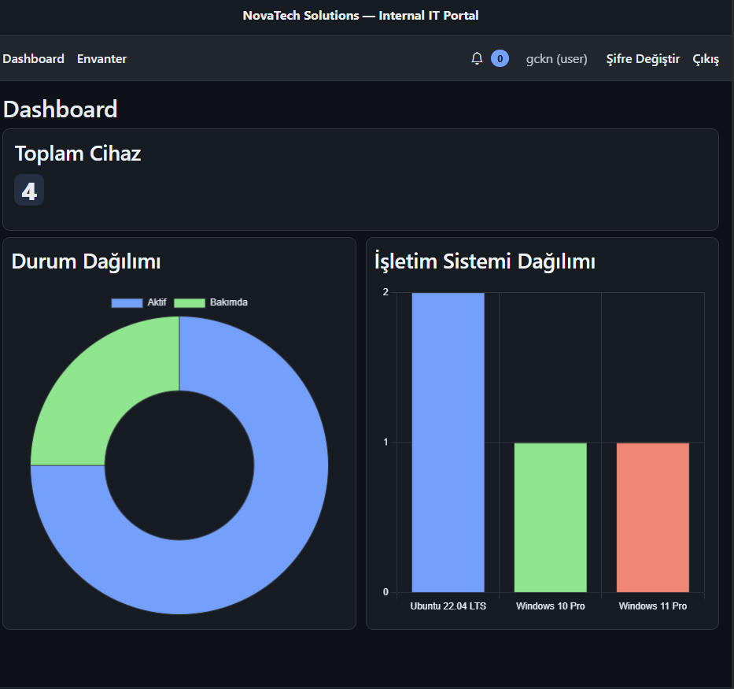
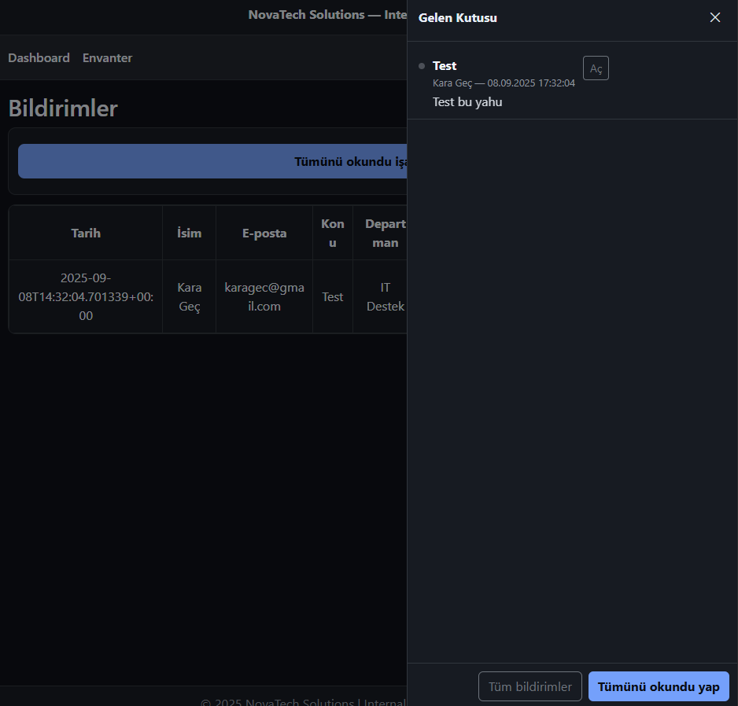
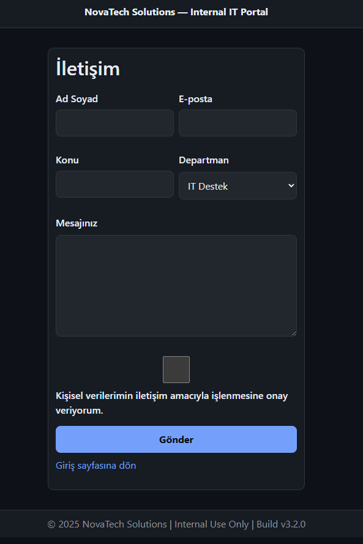

# HW – Inventory & User Management Portal

Bu proje, Flask tabanlı basit bir **kullanıcı yönetimi** ve **envanter takip portalıdır**.
Admin ve kullanıcı rolleri, şifre sıfırlama, envanter CRUD işlemleri, bildirim sistemi ve iletişim formu içerir.
Arayüz, modern koyu tema ve responsive tasarımla hazırlanmıştır.

---

## 🚀 Özellikler

* 🔑 Kullanıcı girişi ve admin paneli
* 👤 Kayıt olma (isteğe bağlı davet kodu ile)
* 🔒 Şifre sıfırlama ve değiştirme
* 💻 Envanter yönetimi (Ekle / Güncelle / Sil / CSV–Excel içe/dışa aktar)
* 📬 İletişim formu ve bildirimler
* 📊 Dashboard üzerinde durum ve işletim sistemi dağılımı grafikleri

---

## 📦 Kurulum

### 1. Depoyu klonla

```bash
git clone https://github.com/kgeckin/W-Code2.0_FrontEnd.git
cd W-Code2.0_FrontEnd/HW
```

### 2. Sanal ortam oluştur

```bash
python -m venv venv
source venv/bin/activate   # Mac/Linux
venv\Scripts\activate      # Windows
```

### 3. Bağımlılıkları yükle

```bash
pip install -r requirements.txt
```

`requirements.txt` içeriği:

```
Flask
python-dotenv
```

### 4. Ortam değişkenlerini ayarla

`.env` dosyası oluştur ve düzenle:

```ini
SECRET_KEY=change-this-to-a-random-32byte-string

# Admin hesabı
ADMIN_USERNAME=admin
ADMIN_PASSWORD_HASH=pbkdf2:sha256:...

# Kullanıcı kaydı
REGISTER_OPEN=true
REGISTER_INVITE_CODE=

# Şifre sıfırlama
RESET_TOKEN_TTL_MIN=20
RESET_DEV_SHOW_TOKEN=true
```

👉 Güçlü bir şifre hash’i oluşturmak için:

```bash
python hash_creator.py
```

### 5. Çalıştır

```bash
python app.py
```

Varsayılan olarak `http://127.0.0.1:5000` üzerinde çalışır.

---

## 📂 Dosya Yapısı

```
HW/
 ├── app.py               # Flask uygulaması
 ├── hash_creator.py      # Şifre hash üretici
 ├── requirements.txt
 ├── .env.example
 ├── data/
 │   ├── users.json
 │   ├── inventory.json
 │   └── contact_messages.json
 ├── templates/
 │   ├── login.html
 │   ├── register.html
 │   ├── forgot.html
 │   ├── reset.html
 │   ├── dashboard.html
 │   ├── inventory.html
 │   ├── admin.html
 │   ├── contact.html
 │   └── notifications.html
 ├── static/
 │   ├── styles.css
 │   └── app.js
 └── README.md
```

---

## 🖥️ Kullanım

* **/login** → Giriş ekranı
* **/register** → Kayıt olma
* **/forgot** → Şifre sıfırlama bağlantısı alma
* **/dashboard** → Genel görünüm ve grafikler
* **/inventory** → Envanter yönetimi (ekle/güncelle/sil)
* **/admin** → Kullanıcı yönetimi (sadece admin)
* **/notifications** → İletişim formu üzerinden gelen bildirimler

---

## 📸 Ekran Görüntüleri

👉 Buraya proje ekran görüntüleri ekleyebilirsiniz:

```




```

---

## 🛡️ Notlar

* `SECRET_KEY` mutlaka güçlü ve benzersiz olmalıdır.
* Admin şifreleri **hash** olarak `.env` dosyasında saklanır.
* JSON dosyaları (`users.json`, `inventory.json`, `contact_messages.json`) varsayılan basit depolama için kullanılır.
  İstenirse veritabanı entegrasyonu yapılabilir.
